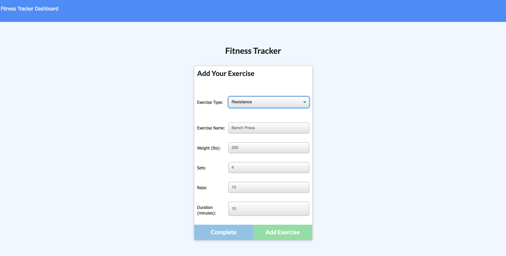
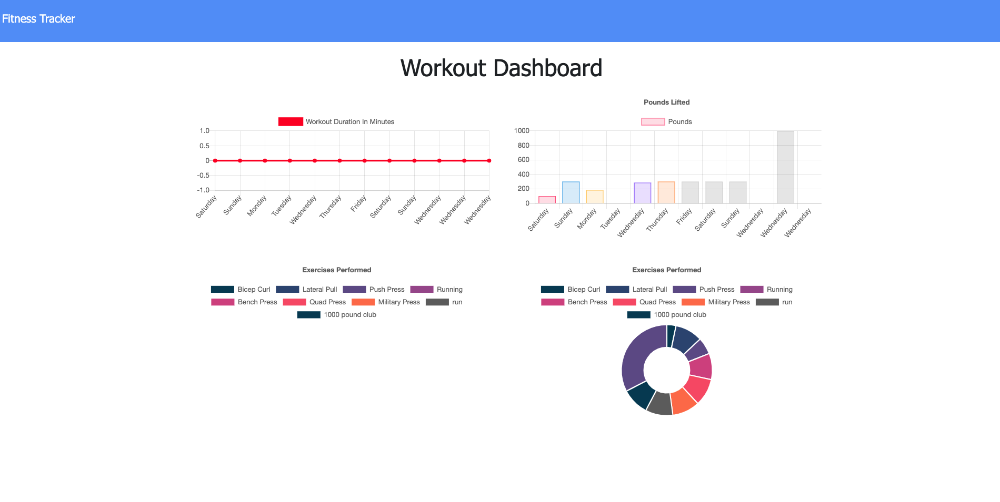
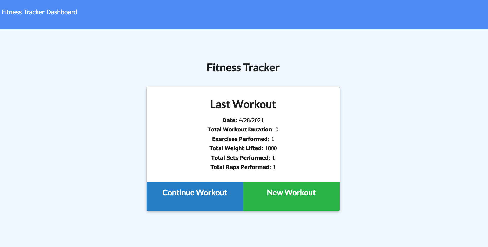

# WorkoutTracker

  

  ## Table of contents
  - [Description](#description)
  - [Installation](#installation)
  - [Usage](#usage)
  - [License](#license)
  - [Contributors](#contributors)
  - [Tests](#tests)
  - [Deployed Site](#deployed-site)
  - [Questions](#questions)

  ## Description
  Workout Tracking app using mongoose for schema build and mongoDB for our database. user gets a very visual front end to track the progress of their fitness journey 

  ## Installation
  no install required. if you decide to fork repository you will npm i and edit the connection to match your own in the seed and server files

  
  
   
  

  ## Usage
  * follow link to deployed application
  * choose new workout, or continue workout
  * fill out prompted questions and hit complete when finished

  ## License
  

  The license covering this application is the MIT license.

  ## Contributors
  I am the sole contributor

  ## Tests
  There are no tests included

  ## Deployed Site
  You can visit the site using <a href="https://peaceful-fjord-93262.herokuapp.com/?id=6082f68ec8cdef87f6813061">heroku</a>

  ## Questions
  Find me on Github or reach out via email

  You can find me on GitHub at [iigonzoii](https://github.com/iigonzoii)

  Email me if you run into any questions at a.gonzalez418@gmail.com
 